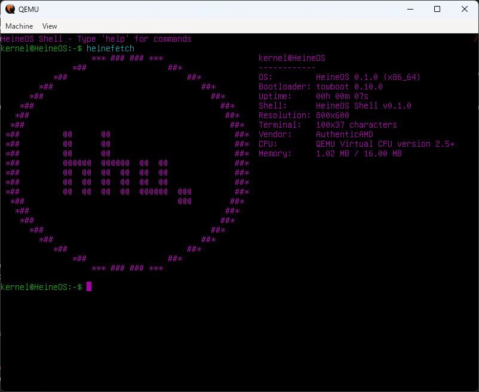

# Project

For `lesson-7` a user friendly shell has been implemented. All demos can be started as a command within that shell. <br>
Additionally further commands have been added to flesh out the terminal experience.
A list of all commands can be displayed using the `help` command.

Several features have been added to improve on the user experience:
- The shell supports autocomplete using the `Scancode::Tab` for all commands or files in the tar-filesystem. This way it is no longer necessary to fully type out long file paths or complicated commands.
- Using the navigation arrow-keys `Scancode::Down` or `Scancode::Up` the shell supports moving through the command history.
- An alias-system has been implemented. To define your own aliases for long commands (including static parameters) you can simply expand upon the `.aliases.txt`-file inside the initrd folder.




## Set up the environment

### Prerequisites

For building HeineOS, a *rust nightly* toolchain is required. To install rust, use [rustup](https://rustup.rs/).
The toolchain `nightly-2026-04-01` is confirmed to work with HeineOS.
We also need `cargo-make` for Makefile-like build scripts.

```bash
rustup toolchain install nightly-2026-04-01
cargo install --no-default-features cargo-make
```

Furthermore, we need to install the *build-essential* tools, as well as the *Netwide Assembler* (nasm) for building HeineOS.
For debugging purposes, *gdb* should also be installed. Last but not least, QEMU is required to run HeineOS in a virtual machine.

On Ubuntu 24.04 you can install all the above with a single apt command:

```bash
sudo apt install build-essential nasm gdb qemu-system-x86
```

On macOS you can use [Homebrew](https://brew.sh/) to install the required tools:

```bash
brew install x86_64-elf-binutils nasm x86_64-elf-gdb qemu
```

### Building and running HeineOS

You should now be able to build and run HeineOS. Clone the repository and run the following commands:

```bash
git clone git@github.com:hhu-bsinfo/HeineOS.git
cd HeineOS
git checkout lesson-1
cargo make --no-workspace qemu
```

QEMU should start and boot HeineOS, which will do nothing but show a black screen.

### Debugging with IDEs

We recommend using either VSCode or RustRover for development, as we provide debugging configurations for both IDEs.

#### RustRover

To debug with RustRover place a breakpoint anywhere in the code (use a line in `main()` for example) and start the *debug* configuration in the upper right corner.
This will build HeineOS and start QEMU which waits for a debugger to attach.


Now launch the *Start Debugger* configuration, which will start gdb and attach it to the running QEMU instance.


QEMU should now continue and stop at the breakpoint you set in the first step, allowing you to inspect variables and step through the code.


#### VSCode

To debug with VSCode first install the *C/C++ Debug (gdb)* extension from the VSCode marketplace.
It is also recommended to install the *rust-analyzer* extension to get rust language support in VSCode.

Now open the *Run and Debug* tab on the left side.


Then start the *debug* configuration in the upper left corner.


This will build HeineOS and launch QEMU and gdb and attach gdb to the running QEMU instance.
If the build process takes too long, VSCode might receive a timeout. In this case, click on "Debug Anyway", or just try again.
The build process should be faster on the second try.


